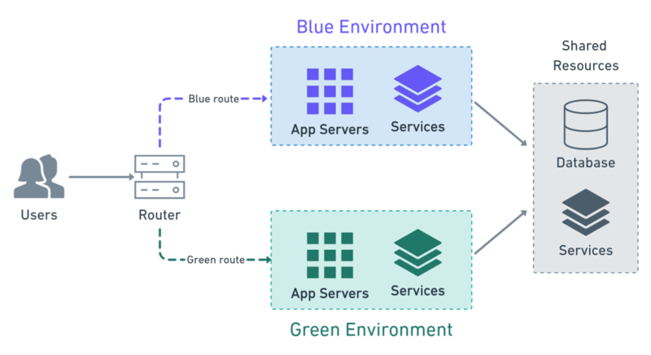

# 30-04-2026

* I changed everything in the code to postgres (check issue with PR's on)
* Migrated the database data with sqlite3 dump file, which i cleansed for DDL statements so that only insert statements where left. Then i piped the data directly into the database in the docker container.
* We are beginning to have a lot of users + web scraping, therefore we need another database as sqlite won't be enough.
* Postgres works better with docker, handlesa concurrent writes, where sqlite locks the entire file.
* See Github Discussion for choices

## Crontab & backups

* Im not sure that the our crontab or backup.sh is shown in the docs but here they are.
* We have been using RClone for backing up the sqllite database and moving it to a shared google drive
* The migration to postgres has made this redundant, which reminded me that this might not be in the documentation

``` Crontab
0 0 * * * /home/appuser/backups/backup_db.sh >> /home/appuser/backups/backup.log 2>&1
```

``` .sh
#!/bin/bash

DB_NAME="/home/appuser/_data/whoknows.db"
BACKUP_DIR="/home/appuser/backups"
REMOTE_GDRIVE="gdrive:"

TIMESTAMP=$(date +"%Y%m%d_%H%M%S")
BACKUP_FILE="$BACKUP_DIR/whoknows_$TIMESTAMP.db"
mkdir -p "$BACKUP_DIR"

# Lav SQLite backup
sqlite3 "$DB_NAME" ".backup '$BACKUP_FILE'"

# Upload til Google Drive
rclone copy "$BACKUP_FILE" "$REMOTE_GDRIVE"

# Slet gamle backups ældre end 7 dage
find "$BACKUP_DIR" -type f -name "*.db" -mtime +7 -delete

```

## Deployment Strategy

### Thinks to consider when deploying
* Zero downtime
* Downtime tolerance
* Scalability
* Rollback plan
* Cost efficiency

### Currently
* Considering these things while deploying, we can surely say that our current deployment method lacks...
* Downtime everytime someone pushes to github, no rollback (unless manually reverting image tag), scalability is non-existent.

### Context
* The most critical thing in our application is having low-downtime and securing user logins. Extreme complexity is therefore not needed. Canary would be overkill and have low cost-efficiency.
* We are realising several times a week.

### Choice
* A good compromise would be something like Blue-Green deployment.
#### Pros
* Really easy to rollback
* Zero downtime
* Low complexity / Low Cost. If we were to implement it we are only 3 developers.
* Good for weekly releases
#### Cons
* Dependent on monitoring system for fast rollbacks
* Developers should never manually test, everything should be automatic. (Setup might take some time)

### Explanation: Blue-Green
* Two identical environments
* Only 1 is live
#### Example:
* Blue is live to begin with
* Green is your staging environment. Once all tests in staging pass, switch the traffic to green.



## Service Level Agreement (SLA)
When i was writing the SLA i was thinking that measuring some things in grafana/prometheus would make it easier.
* API response time => Would give us an SLO more to reach
