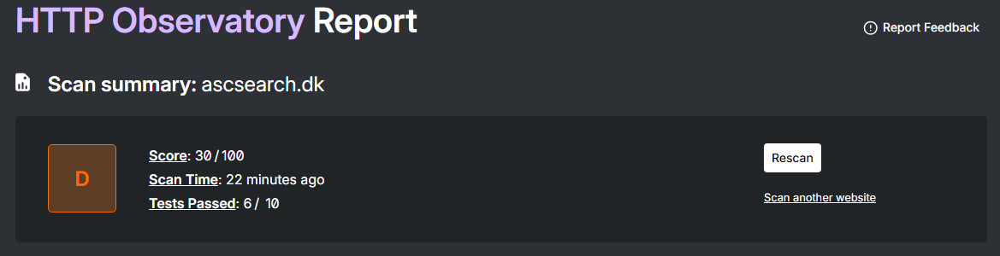
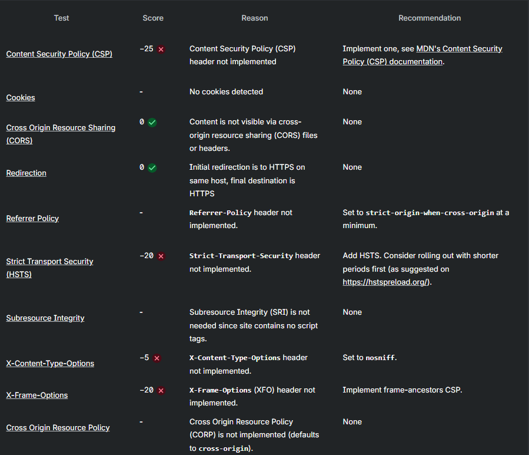

# 24-03-2026

* Added SHA pinning to Github Actions

# 09-04-2026

* Added Https with certbot + nginx reverse proxy.
* Certificate runs out in 90 days, but we should be finished with project at the time.
*

# 16-04-2026
* I have choosen to go with best security from go.dev own webside for the best practices for checking go code. Yet we wont have Fuzzing running in te yml file.
* Additionally, we complement this with OWASP ZAP, since our project is a web service, and ZAP tests the running application from the outside.

* Additionally added Trivy to the CI pipeline.
* Trivy found several vulnerabilities in our Dockerfile

* I also ran Mozilla Observatory.
* I discussed with an LLM, as many of these concepts i had never heard about before. For production-grade with public api, these should all be fixed at some point"🚀".

